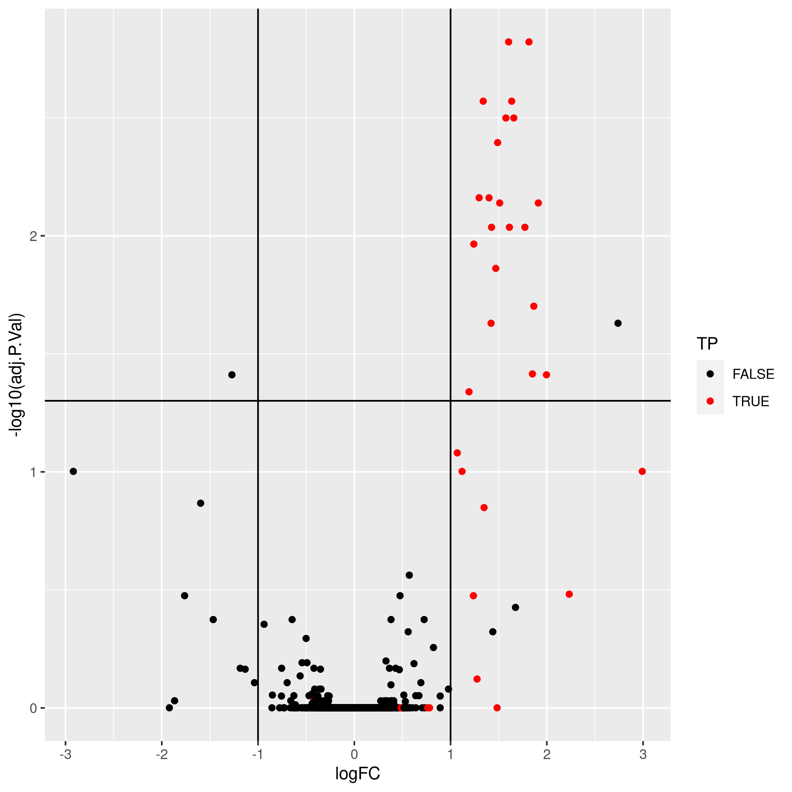

# Quantitative data {#sec:quant}

## Quantitation methodologies

There are a wide range of proteomics quantitation techniques that can
broadly be classified as labelled vs. label-free, depending whether
the features are labelled prior the MS acquisition and the MS level at
which quantitation is inferred, namely MS1 or MS2.

```{r quanttab, echo=FALSE, results='asis'}
qtb <- matrix(c("XIC", "Counting", "SILAC, 15N", "iTRAQ, TMT"),
              nrow = 2, ncol = 2)
dimnames(qtb) <- list(
    'MS level' = c("MS1", "MS2"),
    'Quantitation' = c("Label-free", "Labelled"))

knitr::kable(qtb)
```

### Label-free MS2: Spectral counting

In spectral counting, on simply counts the number of quantified
peptides that are assigned to a protein.

```{r sc, echo=FALSE, out.width = "75%", fig.cap = "Spectral counting. Figure from the `Pbase` package."}
knitr::include_graphics("./img/pbase.png")
```

### Labelled MS2: Isobaric tagging

Isobaric tagging refers to the labelling using isobaric tags,
i.e. chemical tags that have the same mass and hence can't be
distinguish by the spectrometer. The peptides of different samples (4,
6, 10, 11 or 16) are labelled with different tags and combined prior
to mass spectrometry acquisition. Given that they are isobaric, all
identical peptides, irrespective of the tag and this the sample of
origin, are co-analysed, up to fragmentation prior to MS2
analysis. During fragmentation, the isobaric tags fall of, fragment
themselves, and result in a set of sample specific peaks. These
specific peaks can be used to infer sample-specific quantitation,
while the rest of the MS2 spectrum is used for identification.

```{r itraq, echo=FALSE, out.width = "75%", fig.cap = "iTRAQ 4-plex isobaric tagging. Tandem Mass Tags (TMT) offer up to 16 tags."}
knitr::include_graphics("./img/itraq.png")
```

### Label-free MS1: extracted ion chromatograms

In label-free quantitation, the precursor peaks that match an
identified peptide are integrated of retention time and the area under
that *extracted ion chromatogram* is used to quantify that peptide in
that sample.

```{r lf, echo=FALSE, out.width = "75%", fig.cap = "Label-free quantitation. Figure credit [Johannes Rainer](https://github.com/jorainer/)."}
knitr::include_graphics("./img/chrompeaks.png")
```


### Labelled MS1: SILAC

In SILAc quantitation, sample are grown in a medium that contains
heavy amino acids (typically arginine and lysine). All proteins gown
in this *heavy* growth medium contain the heavy form of these amino
acids. Two samples, one grown in heavy medium, and one grown in normal
(light) medium are then combined and analysed together. The heavy
peptides precursor peaks are systematically shifted compared to the
light ones, and the ratio between the height of a heavy and light
peaks can be used to calculate peptide and protein fold-changes.


```{r silab, echo=FALSE, out.width = "75%", fig.cap = "Silac quantitation. Figure credit Wikimedia Commons."}
knitr::include_graphics("./img/Silac.png")
```

These different quantitation techniques come with their respective
benefits and distinct challenges, such as large quantities of raw data
processing, data transformation and normalisation, missing values, and
different underlying statistical models for the quantitative data
(count data for spectral counting, continuous data for the others).


In terms of raw data quantitation in R/Bioconductor, most efforts have
been devoted to MS2-level quantitation. Label-free XIC quantitation
has been addressed in the frame of metabolomics data processing by the
`r Biocpkg("xcms")` infrastructure.

Below is a list of suggested packages for some common proteomics
quantitation technologies:

* Isobaric tagging (iTRAQ and TMT): `r Biocpkg("MSnbase")` and `r Biocpkg("isobar")`.
* Label-free: `r Biocpkg("xcms")` (metabolomics).
* Counting: `r Biocpkg("MSnbase")` and `r Biocpkg("MSnID")` for
  peptide-spectrum matching confidence assessment.
* `r Githubpkg("vladpetyuk/N14N15")` for heavy Nitrogen-labelled data.

## QFeatures {#sec:qf}

Mass spectrometry-based quantitative proteomics data can be
representated as a matrix of quantitative values for features (PSMs,
peptides, proteins) arranged along the rows, measured for a set of
samples, arranged along the columns. There is a common representation
for such quantitative data set, namely the `SummarizedExperiment` (SE)
[@SE] class:

```{r sefig, echo = FALSE, fig.cap = "Schematic representation of the anatomy of a `SummarizedExperiment` object. (Figure taken from the `SummarizedExperiment` package vignette.)", out.width='100%', fig.align='center'}
knitr::include_graphics("./img/SE.png")
```

- The sample (columns) metadata can be access with the `colData()`
  function.
- The features (rows) metadata can be access with the `rowData()`
  column.
- If the features represent ranges along genomic coordinates, these
  can be accessed with `rowRanges()`
- Additional metadata describing the overall experiment can be
  accessed with `metadata()`.
- The quantiative data can be accessed with `assay()`.
- `assays()` returns a list of matrix-like assays.

### The QFeatures class

While mass spectrometers acquire data for spectra/peptides, the
biological entity of interest are the protein. As part of the data
processing, we are thus required to **aggregate** low-level
quantitative features into higher level data.


```{r featuresplot, fig.cap = "Conceptual representation of a `QFeatures` object and the aggregative relation between different assays.", echo = FALSE}
par(mar = c(0, 0, 0, 0))
plot(NA, xlim = c(0, 12), ylim = c(0, 20),
     xaxt = "n", yaxt = "n",
     xlab = "", ylab = "", bty = "n")

for (i in 0:7)
    rect(0, i, 3, i+1, col = "lightgrey", border = "white")


for (i in 8:12)
    rect(0, i, 3, i+1, col = "steelblue", border = "white")

for (i in 13:18)
    rect(0, i, 3, i+1, col = "orange", border = "white")

for (i in 19)
    rect(0, i, 3, i+1, col = "darkgrey", border = "white")


for (i in 5:7)
    rect(5, i, 8, i+1, col = "lightgrey", border = "white")

for (i in 8:10)
    rect(5, i, 8, i+1, col = "steelblue", border = "white")

for (i in 11:13)
    rect(5, i, 8, i+1, col = "orange", border = "white")

for (i in 14)
    rect(5, i, 8, i+1, col = "darkgrey", border = "white")

rect(9, 8, 12, 8+1, col = "lightgrey", border = "white")
rect(9, 9, 12, 9+1, col = "steelblue", border = "white")
rect(9, 10, 12, 10+1, col = "orange", border = "white")
rect(9, 11, 12, 11+1, col = "darkgrey", border = "white")

segments(3, 8, 5, 8, lty = "dashed")
segments(3, 6, 5, 7, lty = "dashed")
segments(3, 4, 5, 6, lty = "dashed")
segments(3, 0, 5, 5, lty = "dashed")

segments(3, 10, 5, 9, lty = "dashed")
segments(3, 11, 5, 10, lty = "dashed")
segments(3, 13, 5, 11, lty = "dashed")

segments(3, 14, 5, 12, lty = "dashed")
segments(3, 16, 5, 13, lty = "dashed")
segments(3, 19, 5, 14, lty = "dashed")

segments(3, 20, 5, 15, lty = "dashed")


segments(8, 5, 9, 8, lty = "dashed")
segments(8, 8, 9, 9, lty = "dashed")
segments(8, 11, 9, 10, lty = "dashed")
segments(8, 14, 9, 11, lty = "dashed")
segments(8, 15, 9, 12, lty = "dashed")
```

We are going to start to familiarise ourselves with the `QFeatures`
class implemented in the
[`QFeatures`](https://rformassspectrometry.github.io/QFeatures/articles/QFeatures.html)
package. The class is derived from the Bioconductor
`MultiAssayExperiment` [@MAE] (MAE) class. Let's start by loading the
`QFeatures` package.


```{r, message = FALSE}
library("QFeatures")
```

Next, we load the `feat1` test data, which is composed of single
*assay* of class `SummarizedExperiment` composed of 10 rows and 2
columns.

```{r load_feat1}
data(feat1)
feat1
```

Let's perform some simple operations to familiarise ourselves with the
`QFeatures` class:

- Extract the sample metadata using the `colData()` accessor (like you
  have previously done with `SummarizedExperiment` objects).

```{r cd}
colData(feat1)
```
We can also further annotate the experiment by adding columns to the `colData` slot:

```{r cd2}
colData(feat1)$X <- c("X1", "X2")
feat1$Y <- c("Y1", "Y2")
colData(feat1)
```

- Extract the first (and only) assay composing this `QFeaures` data
  using the `[[` operator (as you have done to extract elements of a
  list) by using the assay's index or name.

```{r assay1}
feat1[[1]]
feat1[["psms"]]
```

- Extract the `psms` assay's row data and quantitative values.

```{r rd}
assay(feat1[[1]])
rowData(feat1[[1]])
```

### Feature aggregation

The central functionality of the `QFeatures` infrastructure is the
aggregation of features into higher-level features while retaining the
link between the different levels. This can be done with the
[`aggregateFeatures()` function](https://rformassspectrometry.github.io/QFeatures/reference/QFeatures-aggregate.html).

The call below will

- operate on the `psms` assay of the `feat1` objects;
- aggregate the rows the assay following the grouping defined in the
  `peptides` row data variables;
- perform aggregation using the `colMeans()` function;
- create a new assay named `peptides` and add it to the `feat1`
  object.

```{r agg1}
feat1 <- aggregateFeatures(feat1, i = "psms",
                           fcol = "Sequence",
                           name = "peptides",
                           fun = colMeans)
feat1
```

- Let's convince yourself that we understand the effect of feature
  aggregation and repeat the calculations manually and check the
  content of the new assay's row data.

```{r cm}
## SYGFNAAR
colMeans(assay(feat1[[1]])[1:3, ])
assay(feat1[[2]])["SYGFNAAR", ]

## ELGNDAYK
colMeans(assay(feat1[[1]])[4:6, ])
assay(feat1[[2]])["ELGNDAYK", ]

## IAEESNFPFIK
colMeans(assay(feat1[[1]])[7:10, ])
assay(feat1[[2]])["IAEESNFPFIK", ]
```

```{r rd2}
rowData(feat1[[2]])
```


We can now aggregate the peptide-level data into a new protein-level
assay using the `colMedians()` aggregation function.

```{r agg2}
feat1 <- aggregateFeatures(feat1, i = "peptides",
                           fcol = "Protein",
                           name = "proteins",
                           fun = colMedians)
feat1
assay(feat1[["proteins"]])
```


### Subsetting and filtering

The link between the assays becomes apparent when we now subset the
assays for protein A as shown below or using the `subsetByFeature()`
function. This creates a new instance of class `QFeatures` containing
assays with the expression data for protein, its peptides and their
PSMs.

```{r prota}
feat1["ProtA", , ]
```


The `filterFeatures()` function can be used to filter rows the assays
composing a `QFeatures` object using the row data variables. We can
for example retain rows that have a `pval` < 0.05, which would only
keep rows in the `psms` assay because the `pval` is only relevant for
that assay.

```{r ff1}
filterFeatures(feat1, ~ pval < 0.05)
```

On the other hand, if we filter assay rows for those that localise to
the mitochondrion, we retain the relevant protein, peptides and PSMs.

```{r ff2}
filterFeatures(feat1, ~ location == "Mitochondrion")
```

As an exercise, let's filter rows that do not localise to the
mitochondrion.


```{r ff3}
filterFeatures(feat1, ~ location != "Mitochondrion")
```


You can refer to the [*Quantitative features for mass spectrometry
data*](https://rformassspectrometry.github.io/QFeatures/articles/QFeatures.html)
vignette and the `QFeature` [manual
page](https://rformassspectrometry.github.io/QFeatures/reference/QFeatures-class.html)
for more details about the class.


## Creating `QFeatures` object

```{r loaddfr, echo = FALSE}
data(hlpsms)
```

While `QFeatures` objects can be created manually (see `?QFeatures`
for details), most users will probably possess quantitative data in a
spreadsheet or a dataframe. In such cases, the easiest is to use the
`readQFeatures` function to extract the quantitative data and metadata
columns. Below, we load the `hlpsms` dataframe that contains data for
`r ncol(hlpsms)` PSMs from the TMT-10plex *hyper*LOPIT spatial
proteomics experiment from [@Christoforou:2016]. The `ecol` argument
specifies that columns 1 to 10 contain quantitation data, and that the
assay should be named `psms` in the returned `QFeatures` object, to
reflect the nature of the data.


```{r readQFeatures}
data(hlpsms)
hl <- readQFeatures(hlpsms, ecol = 1:10, name = "psms")
hl
```

Below, we see that we can extract an assay using its index or its
name. The individual assays are stored as *SummerizedExperiment*
object and further access its quantitative data and metadata using
the `assay` and `rowData` functions


```{r subsetassay}
hl[[1]]
hl[["psms"]]
head(assay(hl[["psms"]]))
head(rowData(hl[["psms"]]))
```

For further details on how to manipulate such objects, refer to the
`r BiocStyle::Biocpkg("MultiAssayExperiment")` [@MAE] and
`r BiocStyle::Biocpkg("SummerizedExperiment")` [@SE] packages.

It is also possible to first create a `SummerizedExperiment`, and then
only include it into a `QFeatures` object.

```{r}
se <- readSummarizedExperiment(hlpsms, ecol = 1:10)
se
```

```{r}
QFeatures(list(psm = se))
```

At this stage, i.e. at the beginning of the analysis, and respectively
whether you have a `SummerizedExperiment` or a `QFeatures` object, it
is a good time to define the experimental design in the `colData`
slot.

### Exercice {-}

The CPTAC spike-in study 6 [@Paulovich:2010] combines the Sigma UPS1
standard containing 48 different human proteins that are spiked in at
5 different concentrations (conditions A to E) into a constant yeast
protein background. The sample were acquired in triplicate on
different instruments in different labs. We are going to start with a
subset of the CPTAC study 6 containing conditions A and B for a single
lab.

```{r cptac, echo = FALSE, fig.cap = "The CPTAC spike-in study design (credit Lieven Clement, statOmics, Ghent University).", out.width='70%', fig.align='center'}
knitr::include_graphics("./img/cptac.png")
```

The peptide-level data, as processed by MaxQuant [@Cox:2008] is
available in the `msdata` package:

```{r msdata}
basename(f <- msdata::quant(pattern = "cptac", full.names = TRUE))
```

Read these data in as either a `SummerizedExperiment` or a `QFeatures`
object and annotated the experiment.

<details>

From the names of the columns, we see that the quantitative columns,
starting with `"Intensity."` (note the dot!) are at positions 56 to
61.

```{r cptac_cols}
names(read.delim(f))
(i <- grep("Intensity\\.", names(read.delim(f))))
```

We now read these data using the `readSummarizedExperiment`
function. This peptide-level expression data will be imported into R
as an instance of class `SummarizedExperiment`. We also use the
`fnames` argument to set the row-names of the `peptides` assay to the
peptide sequences and specify that the file is a tab-separated table.

```{r readse}
cptac_se <- readSummarizedExperiment(f, ecol = i, fnames = "Sequence", sep = "\t")
cptac_se
```

Before proceeding, we are going to clean up the sample names and
annotate the experiment:

```{r cptac_names}
colnames(cptac_se) <- sub("I.+\\.", "", colnames(cptac_se))
cptac_se$condition <- sub("_[7-9]", "", colnames(cptac_se))
cptac_se$id <- sub("^.+_", "", colnames(cptac_se))
colData(cptac_se)
```

</details>

### Exercice {-}

There are many row variables that aren't useful here. Get rid or all
of them but `Sequence`, `Proteins`, `Leading.razor.protein`, `PEP`,
`Score`, `Reverse`, and `Potential.contaminant`.


<details>

```{r vars}
keep_var <- c("Sequence", "Proteins", "Leading.razor.protein", "PEP",
              "Score", "Reverse", "Potential.contaminant")

rowData(cptac_se) <- rowData(cptac_se)[, keep_var]
```

</details>


## Analysis pipeline

A typical quantitative proteomics data processing is composed of the
following steps, which we are going to apply to the cptac data created
above.

- Data import
- Exploratory data analysis (PCA)
- Missing data management (filtering and/or imputation)
- Data cleaning
- Transformation and normalisation
- Aggregation
- Downstream analysis

```{r pkgs, message = FALSE}
library("tidyverse")
library("ggplot2")
library("QFeatures")
library("limma")
```

### Missing values

Missing values can be highly frequent in proteomics. These exist two
reasons supporting the existence of missing values, namely biological
or technical.

1. Values that are missing due to the absence (or extremely low
   contentration) of a protein are observed for biological reasons,
   and their pattern **aren't random** (MNAR). A protein missing in
   due to the suppression of its expression will not be missing at
   random: it will be missing in the condition in which it was
   suppressed, and be present in the condition where it is expressed.

2. Due to it's data-dependent acquisition, mass spectrometry isn't
   capable to assaying all peptides in a sample. Peptides that are
   less abundant than some of their co-eluting ions, peptides that do
   not ionise well or peptides that do not get identified might be
   sporadically missing in the final quantitation table, despite their
   presence in the biological samples. Their absence patterns are
   (completely) **random** (MAR or MCAR) in such cases.

Often, third party software that produce quantiative data use zeros
instead of properly reporting missing values. We can use the
`zeroIsNA()` function to replace the `0` by `NA` values in our
`cptac_se` object and then explore the missing data patterns across
columns and rows.


```{r na}
cptac_se <- zeroIsNA(cptac_se)
nNA(cptac_se)
```

```{r imagena, echo = FALSE, fig.cap = "Distribution of missing value (white). Peptides row with more missing values are moved towards the top of the figure."}
.image2 <- function (x, yticks = 10,
                     x.cex.axis = 0.75,
                     y.cex.axis = 0.75,
                     xlab = "Samples",
                     ylab = "Features", ...) {
    nc <- ncol(x)
    nr <- nrow(x)
    lab <- colnames(x)
    if (is.null(lab))
        lab <- 1:nc
    graphics::image(t(x), xlab = xlab, ylab = ylab,
                    xaxt = "n",
                    yaxt = "n", ...)
    axis(1, seq(0, 1, 1/(nc - 1)), labels = lab, cex.axis = x.cex.axis)
    yticks <- seq(0, 1, 1/(yticks - 1)) * nr
    axis(2, seq(0, 1, 1/(length(yticks) - 1)),
         labels = round(yticks, 0),
         cex.axis = y.cex.axis)
    invisible(NULL)
}
.x <- is.na(assay(cptac_se))
o <- order(rowSums(.x))
.image2(.x[o, ],
        col = c("black", "white"),
        ylab = "Peptides")
```

Let's now explore these missing values:

- Explore the number or proportion of missing values across peptides
  and samples of the `cptac_se` data.

```{r na2}
barplot(nNA(cptac_se)$nNAcols$pNA)

table(nNA(cptac_se)$nNArows$nNA)
```

- Remove row that have *too many* missing values. You can do this by
  hand or using the `filterNA()` function.

```{r filterna}
## remove rows that have 4 or more NAs out of 6
cptac_se <- filterNA(cptac_se, pNA = 4/6)
```


### Imputation

Imputation is the technique of replacing missing data with probable
values. This can be done with `impute()` method. As we have discussed
above, there are however two types of missing values in mass
spectrometry-based proteomics, namely data missing at random (MAR),
and data missing not at random (MNAR). These two types of missing
data, those missing at random, and those missing not at random, need
to be imputed with [different types of imputation
methods](https://rformassspectrometry.github.io/QFeatures/articles/Processing.html#imputation-1)
[@Lazar:2016].


```{r miximp, echo = FALSE, fig.cap = "Mixed imputation method. Black cells represent presence of quantitation values and light grey corresponds to missing data. The two groups of interest are depicted in green and blue along the heatmap columns. Two classes of proteins are annotated on the left: yellow are proteins with randomly occurring missing values (if any) while proteins in brown are candidates for non-random missing value imputation."}
data(se_na2)
x <- assay(impute(se_na2, "zero"))
x[x != 0] <- 1
suppressPackageStartupMessages(library("gplots"))
heatmap.2(x, col = c("lightgray", "black"),
          scale = "none", dendrogram = "none",
          trace = "none", keysize = 0.5, key = FALSE,
          RowSideColors = ifelse(rowData(se_na2)$randna, "orange", "brown"),
          ColSideColors = rep(c("steelblue", "darkolivegreen"), each = 8))
```


```{r lazar, fig.cap = "Effect of the nature of missing values on their imputation. Root-mean-square error (RMSE) observations standard deviation ratio (RSR), KNN and MinDet imputation. Lower (blue) is better.", echo = FALSE, out.width='100%'}
knitr::include_graphics("./img/imp-sim.png")
```
Generally, it is recommended to use **hot deck** methods (nearest
neighbour (**left**), maximum likelihood, ...) when data are missing
at random.Conversely, MNAR features should ideally be imputed with a
**left-censor** (minimum value (**right**), but not zero, ...) method.


There are various methods to perform data imputation, as described in
`?impute`. The `r CRANpkg("imp4p")` package contains additional
functionality, including some to estimate the randomness of missing
data.

The general syntax for imputation is

```{r impute}
data(se_na2)
## impute missing values using knn imputation
impute(se_na2, method = "knn")
```

#### Exercise {-}

Following the example above, apply a mixed imputation, using knn for
data missing at random and the deterministic minumum left-cencored
imputation for data missing no at random.


<details>
```{r naex1, message = FALSE}
impute(se_na2, "mixed",
       randna = rowData(se_na2)$randna,
       mar = "knn", mnar = "MinDet")
```
</details>

#### Exercise {-}

When assessing missing data imputation methods, such as in [Lazar et
al. (2016)](https://pubs.acs.org/doi/abs/10.1021/acs.jproteome.5b00981),
one often replaces values with missing data, imputes these with a
method of choice, then quantifies the difference between original
(expected) and observed (imputed) values. Here, using the `se_na2`
data, use this strategy to assess the difference between knn and
Bayesian PCA imputation.

<details>
```{r naex2, cache = TRUE}
imp1 <- impute(se_na2, method = "knn")
imp2 <- impute(se_na2, method = "bpca")
summary(abs(assay(imp1)[is.na(assay(se_na2))] - assay(imp2)[is.na(assay(se_na2))]))
summary(as.numeric(na.omit(assay(se_na2))))
```
</details>

#### Exercise {-}

When assessing the impact of missing value imputation on real data,
one can't use the strategy above. Another useful approach is to assess
the impact of the imputation method on the distribution of the
quantitative data. For instance, here is the intensity distribution of
the `se_na2` data. Verify the effect of applying `knn`, `zero`,
`MinDet` and `bpca` on this distribution.

```{r nasetdist, fig.cap = "Intensity disctribution of the `naset` data."}
plot(density(na.omit(assay(se_na2))))
```

<details>

```{r naex3, cache = TRUE}
cls <- c("black", "red", "blue", "steelblue", "orange")
plot(density(na.omit(assay(se_na2))), col = cls[1])
lines(density(assay(impute(se_na2, method = "knn"))), col = cls[2])
lines(density(assay(impute(se_na2, method = "zero"))), col = cls[3])
lines(density(assay(impute(se_na2, method = "MinDet"))), col = cls[4])
lines(density(assay(impute(se_na2, method = "bpca"))), col = cls[5])
legend("topright", legend = c("orig", "knn", "zero", "MinDet", "bpca"),
       col = cls, lwd = 2, bty = "n")
```
</details>

**Tip**: When downstream analyses permit, it might be safer not to
impute data and deal explicitly with missing values. Indeed misssing
data impuration is however not a straightforward thing, as is likely
to dramatically fail when a high proportion of data is missing (10s of
%). It is possible to keep NAs when performing hypothesis
tests^[Still, it is recommended to explore missingness as part of the
exploratory data analysis.], but not to perform a principal component
analysis.


### Identification quality control

As discussed in the previous chapter, PSMs are deemed relevant after
comparison against hist from a decoy database. The origin of these
hits is recorded with `+` in the `Reverse` variable:

```{r revervetab}
table(rowData(cptac_se)$Reverse)
```

Similarly, a proteomics experiment is also searched against a database
of contaminants:

```{r cont}
table(rowData(cptac_se)$Potential.contaminant)
```

Let's visualise some of the cptac's metadata using standard `ggplot2`
code:

#### Exercise {-}

Visualise the identification score and the posterior probability
probability (PEP) distributions from forward and reverse hits and
interpret the figure.

<details>

```{r idqc1}
rowData(cptac_se) %>%
    as_tibble() %>%
    ggplot(aes(x = Score, colour = Reverse)) +
    geom_density()

```

```{r idqc2}
rowData(cptac_se) %>%
    as_tibble() %>%
    ggplot(aes(x = PEP, colour = Reverse)) +
    geom_density()
```

</details>

### Creating the QFeatures data

We can now create our `QFeatures` object using the
`SummarizedExperiment` as show below.

```{r qf}
cptac <- QFeatures(list(peptides = cptac_se))
cptac
```

We should also assign the `QFeatures` column data with the
`SummarizedExperiment` slot.

```{r qfcd}
colData(cptac) <- colData(cptac_se)
```

Note that it is also possible to directly create a `QFeatures` object
with the `readQFeatures()` function and the same arguments as the
`readSummarizedExperiment()` used above. In addition, most functions
used above and below work on single `SummarizedExperiment` objects or
assays within a `QFeatures` object.


### Filtering out contaminants and reverse hits

#### Exercise {-}

Using the `filterFeatures()` function, filter out the reverse and
contaminant hits, and also retein those that have a posterior error
probability smaller than 0.05.

<details>

```{r qcfilter}
cptac <-
    cptac %>%
    filterFeatures(~ Reverse != "+") %>%
    filterFeatures(~ Potential.contaminant != "+") %>%
    filterFeatures(~ PEP < 0.05)
```

</details>

### Log-transformation and normaliation


The two code chunks below log-transform and normalise using the assay
`i` as input and adding a new one names as defined by `name`.

```{r log}
cptac <- logTransform(cptac, i = "peptides",
                      name = "log_peptides")
```

#### Exercise {-}

Use the `normalize()` method to normalise the data. The syntax is the
same as `logTransform()`. Use the `centre.median` method.

<details>

```{r nrom}
cptac <- normalize(cptac, i = "log_peptides",
                   name = "lognorm_peptides",
                   method = "center.median")
```

</details>

#### Exercise {-}

Visualise the result of the transformations above. The
`plotDensities()` function from the `limma` package is very
convenient, but feel free to use boxplots, violin plots, or any other
visualisation that you deem useful to assess the tranformations.

<details>

```{r plotdens, fig.cap = "Three peptide level assays: raw data, log transformed and normalised.", fig.width = 15, fig.height = 5}
par(mfrow = c(1, 3))
limma::plotDensities(assay(cptac[["peptides"]]))
limma::plotDensities(assay(cptac[["log_peptides"]]))
limma::plotDensities(assay(cptac[["lognorm_peptides"]]))
```
</details>

### Aggregation

#### Exercise {-}

Use median aggregation to aggregation peptides into protein
values. This is not necessarily not the best choice, as we will see
later, but a good star.


<details>

```{r qfagg1, message = FALSE}
cptac <-
    aggregateFeatures(cptac,
                      "lognorm_peptides",
                      name = "proteins_med",
                      fcol = "Leading.razor.protein",
                      fun = colMedians,
                      na.rm = TRUE)
```

</details>

Looking at the `.n` row variable computed during the aggregation, we
see that most proteins result of the aggregation of 5 peptides or
less, while very few proteins are accounted for by tens of peptides.

```{r}
table(rowData(cptac[["proteins_med"]])$.n)
```

### Principal component analysis

```{r pca, message = FALSE}
library("factoextra")

pca_pep <-
    cptac[["lognorm_peptides"]] %>%
    filterNA() %>%
    assay() %>%
    t() %>%
    prcomp(scale = TRUE, center = TRUE) %>%
    fviz_pca_ind(habillage = cptac$condition, title = "Peptides")

pca_prot <-
    cptac[["proteins_med"]] %>%
    filterNA() %>%
    assay() %>%
    t() %>%
    prcomp() %>%
    fviz_pca_ind(habillage = cptac$condition,
                 title = "Proteins (median aggregation)")

```

```{r plotpca, fig.width = 12, fig.height = 6, fig.cap = "Peptide and protein level PCA analyses."}
library("patchwork")
pca_pep + pca_prot
```

### Visualisation

Below, we use the `longFormat()` function to extract the quantitative
and row data in a long format, that can be directly reused by the
tidyverse tools.


```{r vis, message = FALSE, warning = FALSE, fig.width = 12, fig.height = 6, fig.cap = "Peptide and protein expression profile."}
longFormat(cptac["P02787ups|TRFE_HUMAN_UPS", ,
                 c("lognorm_peptides", "proteins_med")]) %>%
    as_tibble() %>%
    mutate(condition = ifelse(grepl("A", colname), "A", "B")) %>%
    ggplot(aes(x = colname, y = value, colour = rowname, shape = condition)) +
    geom_point(size = 3) +
    geom_line(aes(group = rowname)) +
    facet_grid(~ assay) +
    ggtitle("P02787ups|TRFE_HUMAN_UPS")
```

### Statistical analysis

R in general and Bioconductor in particular are well suited for the
statistical analysis of data of quantitative proteomics data. Several
packages provide dedicated resources for proteomics data:

- `r Biocpkg("MSstats")` and `r Biocpkg("MSstatsTMT")`: A set of tools
  for statistical relative protein significanceanalysis in Data dependent
  (DDA), SRM, Data independent acquisition (DIA) and TMT experiments.

- `r Biocpkg("msmsTests")`: Statistical tests for label-free LC-MS/MS
  data by spectral counts, to discover differentially expressed
  proteins between two biological conditions. Three tests are
  available: Poisson GLM regression, quasi-likelihood GLM regression,
  and the negative binomial of the `r Biocpkg("edgeR")`
  package. All can be readily applied on `MSnSet` instances produced,
  for example by `MSnID`.

- `r Biocpkg("DEP")` provides an integrated analysis workflow for the
  analysis of mass spectrometry proteomics data for differential
  protein expression or differential enrichment.

- `r BiocStyle::Githubpkg("statOmics/MSqRob")`: The `MSqRob` package
  allows a user to do quantitative protein-level statistical inference
  on LC-MS proteomics data. More specifically, our package makes use
  of peptide-level input data, thus correcting for unbalancedness and
  peptide-specific biases. As previously shown ([Goeminne et
  al. (2015)](https://pubs.acs.org/doi/abs/10.1021/pr501223t)), this
  approach is both more sensitive and specific than summarizing
  peptide-level input to protein-level values. Model estimates are
  stabilized by ridge regression, empirical Bayes variance estimation
  and downweighing of outliers. Currently, only label-free proteomics
  data types are supported. `msqrob2` is currently under development
  and will be using `QFeatures` objects.

- `r BiocStyle::Githubpkg("const-ae/proDA")` accounts for missing
  values in label-free mass spectrometry data without imputation. The
  package implements a probabilistic dropout model that ensures that
  the information from observed and missing values are properly
  combined. It adds empirical Bayesian priors to increase power to
  detect differentially abundant proteins.

Others, while not specfic to proteomics, are also recommended, such as
the `r Biocpkg("limma")` package. When analysing spectral counting
data, methods for high throughput sequencing data are
applicable. Below, we illustrate how to apply a typical `edgeR` test
to count data using the `msms.edgeR` function from the `msmsTests`
package.


Below, we are going to perform our statistical analysis on the protein
data using `limma`.


```{r protse}
prots <- cptac[["proteins_med"]]
colData(prots) <- colData(cptac)
```

The `r BiocStyle::Biocpkg("limma")` package is the precursor package
that enables the consistent application of linear models to normalliy
distributed omics data in general, and microarrays in
particuar.

The `limma` package implements an empirical Bayes method that provides
borrows information across features to estimate the standard error and
calculate (so called moderate) t statistics. This approach is
demonstrably more powerful that a standard t-tests when the number of
samples is lot.

The code chunk below illstrated how to set up the model, fit it, and
apply the empirical Bayes moderation.

```{r limma, message = FALSE}
library("limma")
design <- model.matrix(~ prots$condition)
fit <- lmFit(assay(prots), design)
fit <- eBayes(fit)
```

Finally, the `topTable()` function is used the extract the results for
the coefficient of interest.

```{r res}
res <-
    topTable(fit, coef = "prots$condition6B", number = Inf) %>%
    rownames_to_column("protein") %>%
    as_tibble() %>%
    mutate(TP = grepl("ups", protein))
```

Note the warning about partial `NA` coefficients for 23 probes:

```{r nacoefs}
na_coefs <-
    filter(res, is.na(t)) %>%
    pull(protein)
assay(prots[na_coefs, ])
```

We can now visualise the results using a volcano plot:

```{r vp, fig.cap = "Volcano plot highlighing spiked-in proteins in red."}
res %>%
    ggplot(aes(x = logFC, y = -log10(adj.P.Val))) +
    geom_point(aes(colour = TP)) +
    geom_vline(xintercept = c(-1, 1)) +
    geom_hline(yintercept = -log10(0.05)) +
    scale_color_manual(values = c("black","red"))
```


Using the pipeline described above, we would would identify a single
differentially expressed protein at an 5 percent FDR but miss out the
other `r sum(res$TP) - 1` expected spike-in proteins.

We can assess our results in terms of true/false postitves/negatives:

- True positives: `r nrow(filter(res, adj.P.Val < 0.05 & TP))`
- False positives: `r nrow(filter(res, adj.P.Val < 0.05 & !TP))`
- True negatives: `r nrow(filter(res, adj.P.Val > 0.05 & !TP))`
- False negatives: `r nrow(filter(res, adj.P.Val > 0.05 & TP))`


##  Summary exercice

As shown below, it is possible to substantially improve these results
by aggregating features using a robust summarisation (available as
`MsCoreUtils::robustSummary()`), i.e robust regression with
M-estimation using Huber weights, as described in section 2.7 in
[@Sticker:2019].


```{r echo = FALSE, message = FALSE, warning = FALSE, fig.cap = "Aggregation using robust summarisation."}

```

- True positives: 21
- False positives: 2
- True negatives: 1340
- False negatives: 12

Repeat and adapt what we have seen here using, for example, the
`robustSummary()` function.
